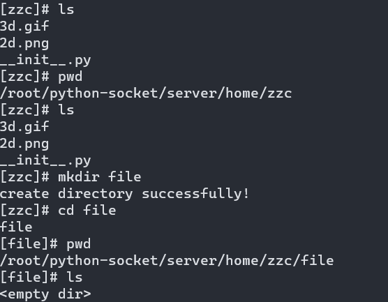
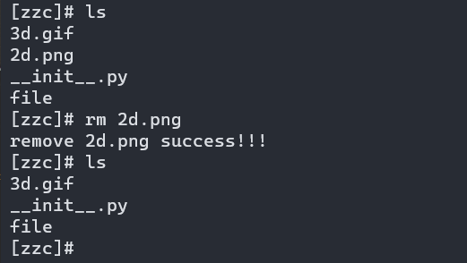
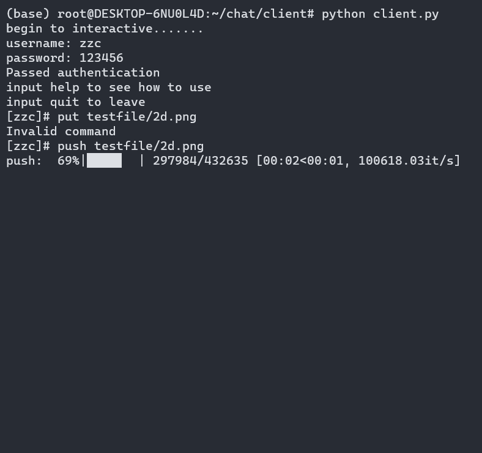
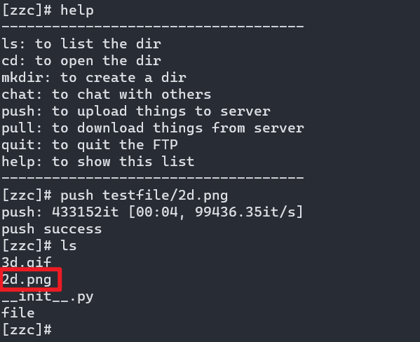
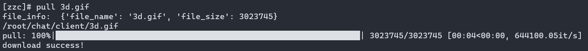
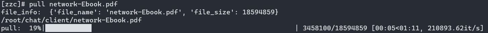
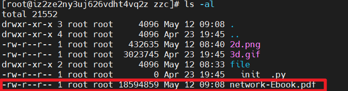
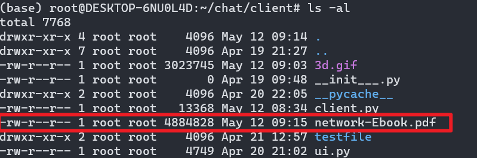
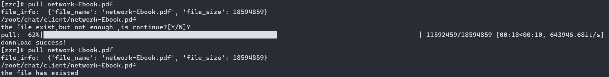

# XJTU 计算机网络实验8(Socket programing)

> zichengsaber

## 实现一个简单的聊天/文件传输程序(C/S)

### 框架

### 功能展示

**登录**
在云服务器上启动`server.py`,此时的IP应该为你的服务器的内网的IP
.png)

在本地启动`client.py`,此时的IP应该是你的服务器的公网的IP
.png)

**聊天**
为了展示聊天功能我们需要在本地开启另一个`client.py`进程
.png)
聊天界面
.png)
.png)

**shell 命令**
客户端可以在服务器的个人文件夹下建立目录，删除文件

**上传文件**

**下载文件**

**断点续传**
传输过程中人为断开网络连接

原文件大小

本地已经下载的大小

断点续传

