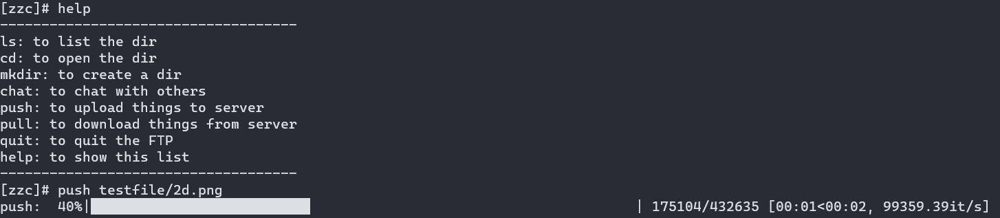

# XJTU 计算机网络实验8(Socket programing)

> zichengsaber

## 实现一个简单的聊天/文件传输程序(C/S)

### 展示

聊天展示


文件上传

### 用法
在server文件夹下直接运行`server.py`使用默认的`ip`和`port`

```sh
python server.py
```
or者自定义

```sh
python server.py --ip <ip address> --port <port>
```

client端同理
```sh
python client.py 
```
or
```sh
python client.py --ip <ip address> --port <port>
```

客户端用法可以登录后输入`help`查看

```sh
------------------------------------
ls: to list the dir
cd: to open the dir
mkdir: to create a dir
chat: to chat with others
push: to upload things to server
pull: to download things from server
quit: to quit the FTP
help: to show this list
------------------------------------
```


